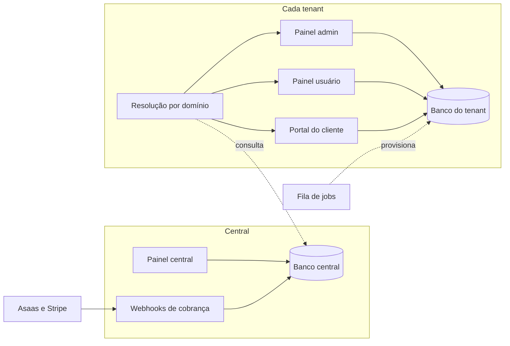

<div align="center">

# Multi_Tenant

**Base multi-tenant com um banco por empresa, pronta para você construir o seu produto por assinatura em cima.**

[](https://php.net)
[](https://laravel.com)
[](https://filamentphp.com)
[](https://livewire.laravel.com)
[](https://tenancyforlaravel.com)

[](https://www.mysql.com)
[](https://redis.io)
[](https://laravel.com/docs/sail)
[](https://www.asaas.com)
[](https://stripe.com)

[](#qualidade)
[](#qualidade)
[](#qualidade)
[](#qualidade)
[](LICENSE)

[](https://www.linkedin.com/in/uendelsilveira)
[](https://usdeveloper.com.br)

</div>

---

## O que é

Todo produto vendido por assinatura para várias empresas começa refazendo a mesma fundação: separar os dados de cada empresa, dar a cada uma o próprio endereço, controlar quem vê o quê, definir o que cada plano inclui e cobrar por isso. Este repositório é essa fundação, pronta e testada, para você começar direto no que o seu produto tem de diferente.

Não é um produto final. É a base sobre a qual os módulos de negócio são construídos.

## O que você recebe pronto

- **Um banco de dados por empresa contratante (tenant)**, criado e migrado em fila no momento do cadastro.
- **Resolução por domínio**: cada domínio identifica o tenant e o painel a que leva. Subdomínios e domínios próprios do cliente, com verificação manual no painel central.
- **Quatro painéis em Filament**: o central, da operadora da plataforma, e três por tenant, um para cada tipo de pessoa: admin (`/admin`), usuário (`/app`) e cliente (`/portal`).
- **Pessoas e perfis**: perfis de sistema fixos e perfis customizados pelo tenant, com permissões tiradas de um catálogo.
- **Planos, ciclos e funcionalidades**: planos com preço mensal, semestral e anual; funcionalidades liberadas pelo plano e ligadas ou desligadas pelo admin do tenant.
- **Clientes** com vínculo N:N: cada usuário vê só os clientes que atende.
- **Primeiro acesso seguro**: senha provisória por e-mail, com validade de 24 horas e troca obrigatória.
- **Situação do tenant**: suspensão com bloqueio total, alteração manual com motivo, trava por prazo e histórico de tudo.
- **Cobrança recorrente** com Asaas e Stripe: assinatura criada no cadastro, webhooks, carência de 10 dias, suspensão e reativação automáticas.
- **Isolamento também contra a operadora**: o painel central nunca lê o banco de um tenant.

## Como funciona



Toda requisição a um domínio de tenant passa primeiro pela resolução, que consulta o banco central para saber de qual tenant é o domínio e para qual painel ele aponta. Só então a sessão é aberta, já no banco daquele tenant. O que não pode travar a tela roda em fila: criar o banco do tenant, criar a assinatura no gateway, enviar a senha provisória e processar os eventos de cobrança.

## Início rápido

Requisitos: Docker e Git. O ambiente roda em [Laravel Sail](https://laravel.com/docs/sail), com PHP 8.4, MySQL e Redis.

```bash
git clone https://github.com/uendelsilveira/Multi_Tenant.git
cd Multi_Tenant
cp .env.example .env

# Instala as dependências sem precisar de PHP na máquina
docker run --rm -u "$(id -u):$(id -g)" -v "$(pwd):/var/www/html" -w /var/www/html \
    laravelsail/php84-composer:latest composer install --ignore-platform-reqs

./vendor/bin/sail up -d
./vendor/bin/sail artisan key:generate
./vendor/bin/sail artisan migrate --seed
./vendor/bin/sail npm install
./vendor/bin/sail npm run build
```

Em dois terminais separados, deixe rodando a fila e o agendador. Sem a fila, nenhum tenant é provisionado; sem o agendador, a carência da cobrança não é aplicada.

```bash
./vendor/bin/sail artisan queue:work
./vendor/bin/sail artisan schedule:work
```

Abra `http://localhost/admin` e entre com o usuário de desenvolvimento:

| E-mail | Senha | Papel |
|---|---|---|
| `admin@central.com` | `password` | Admin |

> Os usuários criados pelo seeder têm senha conhecida e servem só para desenvolvimento. Troque-os antes de publicar qualquer ambiente.

### Seu primeiro tenant

1. **Planos → Novo.** Dê um nome e um preço para pelo menos um ciclo.
2. **Tenants → Novo.** Preencha o slug, os dados da empresa, o plano, o ciclo e o gateway. Em Domínios, informe `acme.localhost` apontando para o painel Admin. Endereços `*.localhost` resolvem para a sua máquina sem configuração.
3. **Aguarde o ambiente ficar "Pronto"** na listagem. É a fila criando o banco do tenant.
4. **Domínios → Marcar como verificado.** Todo domínio nasce pendente e só responde depois disso.
5. **Pegue a senha provisória.** Em desenvolvimento o e-mail é gravado em `storage/logs/laravel.log`.
6. **Abra `http://acme.localhost/admin`**, entre com o e-mail de contato do tenant e a senha provisória, e defina a senha definitiva.

Sem as credenciais dos gateways no `.env`, a assinatura do tenant aparece como "Falhou ao criar". Isso não impede o uso: é só a cobrança que não foi criada.

## Como começar o seu produto a partir desta base

1. **Crie o seu repositório a partir deste**, com "Use this template" no GitHub ou com um fork.
2. **Ajuste a identidade**: `APP_NAME` no `.env`, o nome do pacote em `composer.json` e as cores dos painéis em `app/Providers/Filament`.
3. **Leia o glossário** em [`CONTEXT.md`](CONTEXT.md). Os nomes do código vêm dele: tenant, painel, perfil, tipo base, funcionalidade, plano.
4. **Construa o seu primeiro módulo** seguindo o guia [`docs/05-guia/criando-um-modulo.md`](docs/05-guia/criando-um-modulo.md). Em resumo:
   - declare a funcionalidade em `config/features.php` e rode `sail artisan features:sync`;
   - declare as permissões em `config/permissions.php`;
   - crie as tabelas em `database/migrations/tenant`;
   - escreva o caso de uso em camadas e as telas no painel certo, em `app/Filament/Tenant/{Admin,User,Customer}`.
5. **Valide a cobrança em sandbox** antes de cobrar alguém. Veja [Estado e limites](#estado-e-limites).

## Estrutura

```
app/
├── Actions/            Casos de uso. Orquestram, emitem eventos, não têm regra
├── Services/           Regras de negócio
│   ├── Billing/        Gateways de cobrança (Asaas, Stripe)
│   └── Tenancy/        Infraestrutura do ambiente do tenant
├── Repositories/       Acesso a dados, sempre atrás de interface
├── DTOs/               Dados que cruzam as camadas
├── Exceptions/         Violações de regra, com mensagem para o usuário
├── Events/ Listeners/ Jobs/    Tudo o que roda em segundo plano
├── Policies/           Quem pode o quê
├── Http/Middleware/    Resolução de domínio, provisionamento, suspensão, funcionalidade
└── Filament/
    ├── Resources/      Painel central
    └── Tenant/
        ├── Admin/      Painel admin do tenant
        ├── User/       Painel do usuário
        └── Shared/     Peças usadas por mais de um painel

config/
├── features.php        Catálogo de funcionalidades
├── permissions.php     Catálogo de permissões
└── billing.php         Carência, vencimento e credenciais dos gateways

database/migrations/            Banco central
database/migrations/tenant/     Banco de cada tenant

docs/                   Requisitos, modelagem, arquitetura, decisões e guias
CONTEXT.md              Glossário do domínio
```

O fluxo de qualquer caso de uso é o mesmo: a tela monta um DTO e chama uma Action; a Action chama o Service, onde mora a regra; o Service fala com Repositories. Telas do Filament não têm regra de negócio nem consultam o banco por conta própria.

## Qualidade

```bash
./vendor/bin/sail artisan test                 # 221 testes
./vendor/bin/sail artisan test --coverage      # 94,6% de cobertura
./vendor/bin/sail composer phpstan             # nível 8, sem erros
./vendor/bin/sail pint                         # estilo, com strict_types e classes final
```

Parte dos testes cria bancos de tenant de verdade no MySQL e os remove no fim. Eles estão no grupo `real-database`; para rodar só os demais, use `--exclude-group=real-database`.

Os números dos selos no topo são os medidos na versão `v1.0.0-beta.1`.

## Produção

O que precisa existir no ambiente, além da aplicação:

| Item | Por quê |
|---|---|
| Worker de fila (`queue:work` sob supervisor, ou Horizon) | Provisionamento, senhas provisórias, assinaturas e webhooks |
| Agendador (`schedule:run` no cron, a cada minuto) | Carência da cobrança |
| Serviço de e-mail configurado | As senhas provisórias saem por e-mail |
| Credenciais dos gateways no `.env` | `ASAAS_API_KEY`, `ASAAS_WEBHOOK_TOKEN`, `STRIPE_SECRET`, `STRIPE_WEBHOOK_SECRET` |
| URL pública para `/webhooks/asaas` e `/webhooks/stripe` | Os gateways avisam pagamentos e vencimentos por ali |
| Certificado para os domínios dos tenants | Domínios próprios são cadastrados a qualquer momento |
| Driver de cache com suporte a tags (Redis) | O cache é separado por tenant |

O passo a passo de implantação e as rotinas de operação estão em [`docs/06-entrega/runbook.md`](docs/06-entrega/runbook.md).

## Documentação

| Onde | O que tem |
|---|---|
| [`CONTEXT.md`](CONTEXT.md) | Glossário, relações entre os conceitos e o mapa de cada ação até a classe que a executa |
| [`docs/01-problema`](docs/01-problema) | O problema que a base resolve e o que está fora do escopo |
| [`docs/02-requisitos`](docs/02-requisitos) | Requisitos funcionais, regras de negócio, requisitos não funcionais e a matriz de rastreabilidade até os testes |
| [`docs/03-modelagem`](docs/03-modelagem) | Diagrama dos dois bancos e ciclos de vida |
| [`docs/04-arquitetura`](docs/04-arquitetura) | Fluxos, respostas aos requisitos não funcionais e o estado atual |
| [`docs/05-guia`](docs/05-guia) | Como criar um módulo sobre a base |
| [`docs/06-entrega`](docs/06-entrega) | Runbook de implantação e operação |
| [`docs/adr`](docs/adr) | As dez decisões de arquitetura, com as alternativas descartadas |
| [`CHANGELOG.md`](CHANGELOG.md) | O que cada versão trouxe |

## Estado e limites

A versão atual é a `v1.0.0-beta.1`. As oito fatias planejadas estão implementadas e cobertas por testes. É "beta" por um motivo específico:

- **A cobrança não foi testada contra o Asaas nem contra o Stripe de verdade.** As integrações foram escritas a partir da documentação pública dos dois e testadas contra respostas simuladas. Antes de cobrar alguém, rode o roteiro de validação em sandbox descrito em [`docs/04-arquitetura/estado-atual.md`](docs/04-arquitetura/estado-atual.md).

Outros limites que vale conhecer antes de começar:

- Não há módulos de negócio. O catálogo de funcionalidades vem vazio, e o portal do cliente abre sem conteúdo.
- A emissão automática de certificado para domínios próprios não está configurada.
- Excluir um tenant não cancela a assinatura dele no gateway.
- Upload de arquivo em painel de tenant precisa de um ajuste na rota do Livewire, ainda não feito.

A lista completa, com 20 itens, está em [`estado-atual.md`](docs/04-arquitetura/estado-atual.md).

## Licença

Distribuído sob a licença [MIT](LICENSE). Você pode usar, modificar e distribuir, inclusive em projetos comerciais, mantendo o aviso de copyright.

## Autor

<div align="center">

**Uendel Silveira**
Desenvolvedor web · PHP e Laravel

**US TECH DEVELOPER**
*Tecnologia que conecta. Soluções que transformam.*

[](https://usdeveloper.com.br)
[](https://www.linkedin.com/in/uendelsilveira)
[](https://github.com/uendelsilveira)
[](mailto:contato@usdeveloper.com.br)

Precisa de um sistema sob medida ou de ajuda para construir o seu produto sobre esta base? [Fale com a US Developer](https://usdeveloper.com.br).

</div>
