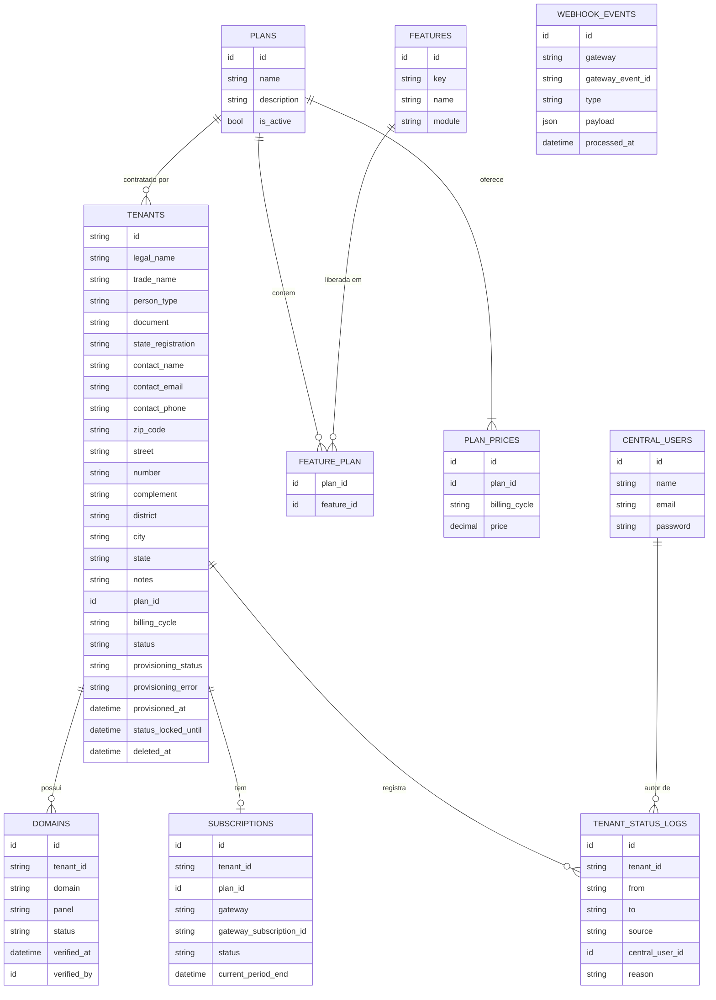
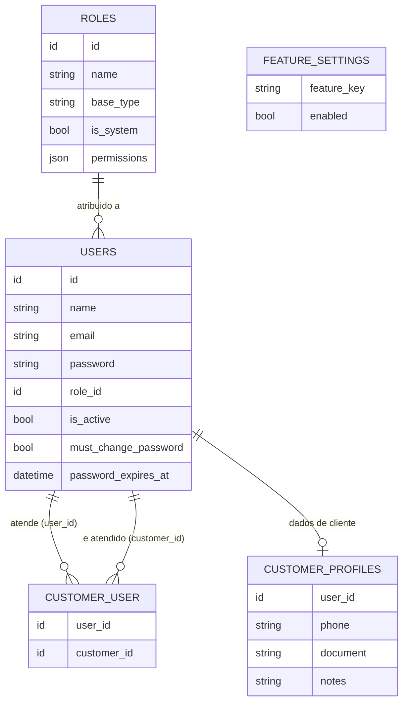
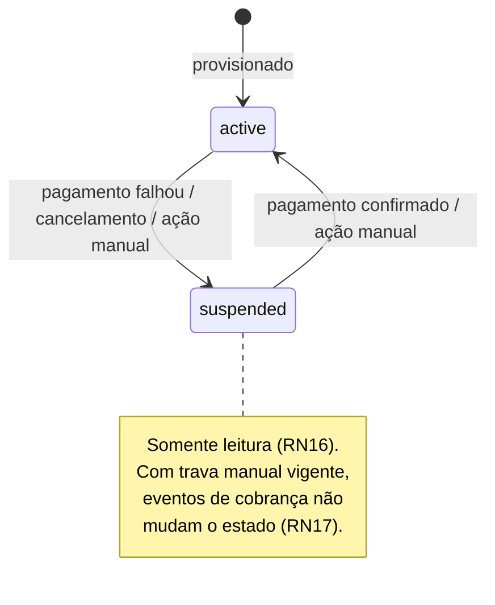
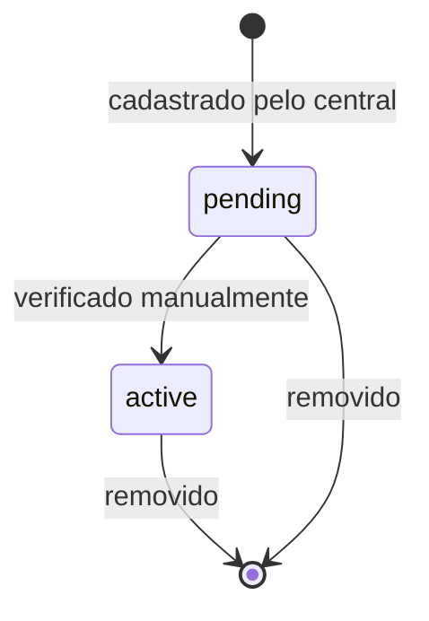

# Modelo de dados

> Gate desta fase: toda entidade existe no glossário (`CONTEXT.md`).

São dois bancos. O **central** é único. O **banco do tenant** existe um por tenant, com a mesma estrutura. Não há chave estrangeira entre os dois: o vínculo é feito em tempo de execução pela resolução do domínio.

## Banco central

Restrições:

- `tenants.id` é o slug (RN20). `tenants.document` é único. `tenants.deleted_at` marca a exclusão lógica (RN24).
- `plan_prices` tem unicidade em `(plan_id, billing_cycle)`. `billing_cycle` ∈ `monthly | semiannual | annual`, em `plan_prices` e em `tenants`.
- `tenants.status_locked_until` ainda não existe no banco: entra com a fatia de situação.
- `tenants.provisioning_status` ∈ `pending | provisioning | ready | failed`. É independente de `tenants.status`: um diz se o ambiente existe, o outro se o tenant pode operar.
- `domains.domain` é único.
- `domains.panel` ∈ `admin | user | customer`. `domains.status` ∈ `pending | active`.
- `tenants.status` ∈ `active | suspended`.
- `webhook_events` tem unicidade em `(gateway, gateway_event_id)`.
- `tenant_status_logs.source` ∈ `gateway | manual`. `central_user_id` e `reason` são obrigatórios quando `manual`.

## Banco do tenant

Restrições:

- `roles.base_type` ∈ `admin | user | customer`.
- `customer_user` aponta duas vezes para `users`: `user_id` é uma pessoa de tipo base `user`, `customer_id` é uma pessoa de tipo base `customer`. A validação desses tipos é regra de serviço, não do banco. Ver ADR-0003.
- `feature_settings.feature_key` referencia `features.key` do central por valor, sem chave estrangeira.
- As permissões não têm tabela: o catálogo fica em `config/permissions.php` e `roles.permissions` guarda as chaves marcadas em um perfil customizado (ADR-0009). Perfil de sistema não usa a coluna.
- Os três perfis de sistema são criados pela própria migration, em todo tenant.
- `users.must_change_password` e `users.password_expires_at` controlam a senha provisória; `users.is_active` a desativação.
- `customer_profiles` guarda o que só cliente tem, em relação 1:1 com a pessoa, para não inflar `users` (ADR-0003).
- No código, a mesma linha de `users` é lida por dois models: `TenantUser`, que autentica, e `Customer`, que é a visão de cadastro, restrita a perfis de tipo cliente.

## Ciclo de vida do tenant

## Ciclo de vida do domínio

