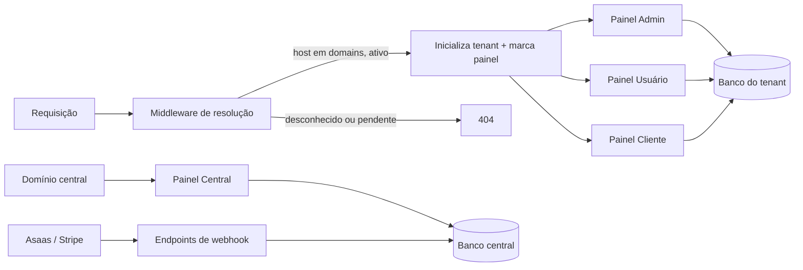
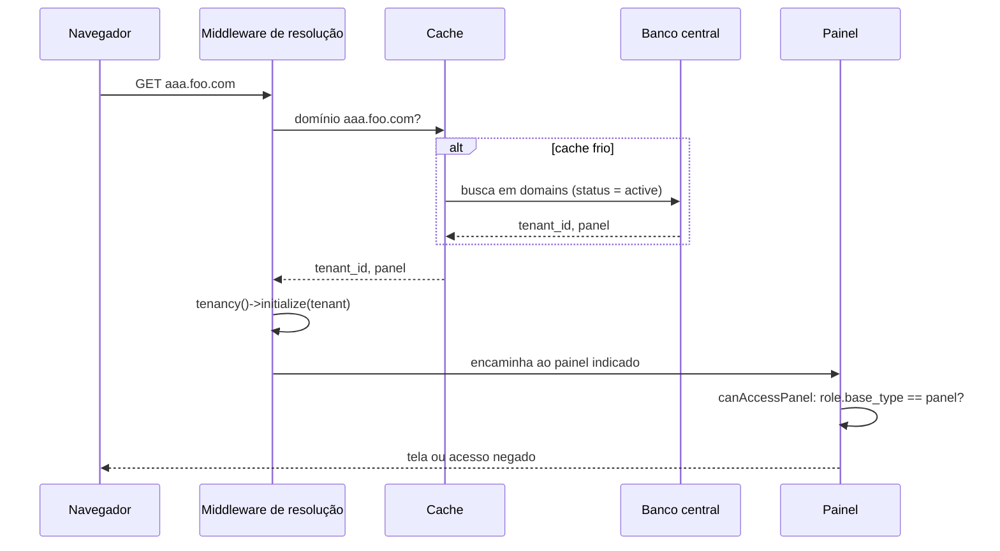
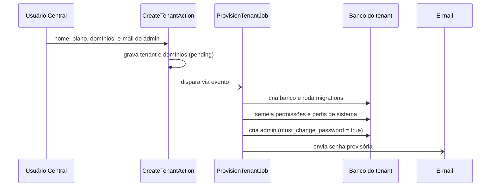
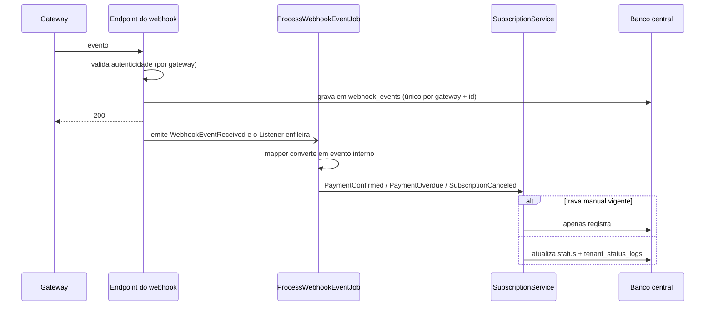

# Arquitetura — visão geral

Padrão técnico de referência: `laravel-tech-standard` (fluxo FormRequest → Controller → DTO → Action → Service → Repository → Model → Resource, banco por tenant com `stancl/tenancy`, painéis em Filament).

## Componentes

O painel central roda em domínios fixos de configuração e nunca inicializa tenancy. Os três painéis de tenant só existem depois que o middleware resolveu o domínio.

## Fluxo: resolução de uma requisição

## Fluxo: provisionamento

O job é o único ponto em que o lado central escreve no banco de um tenant.

## Fluxo: evento de cobrança

Mapa de eventos (conferir nomes na documentação vigente de cada gateway antes de implementar):

| Evento interno | Asaas | Stripe |
|---|---|---|
| PaymentConfirmed | `PAYMENT_CONFIRMED`, `PAYMENT_RECEIVED` | `invoice.paid` |
| PaymentOverdue | `PAYMENT_OVERDUE` | `invoice.overdue`, `invoice.payment_failed` |
| SubscriptionCanceled | `SUBSCRIPTION_DELETED`, `SUBSCRIPTION_INACTIVATED` | `customer.subscription.deleted` |

## Resposta arquitetural a cada RNF

> Gate desta fase: cada RNF tem uma resposta.

| RNF | Resposta |
|---|---|
| RNF01 Isolamento | Banco por tenant; conexão trocada em tempo de execução; models centrais não leem tabelas de tenant; cache com tag `tenant-{id}`; todo job de tenant inicializa tenancy no `handle()` |
| RNF02 Resolução | Consulta a `domains` em cache, invalidado ao criar, verificar ou remover domínio |
| RNF03 Provisionamento | Job assíncrono em fila dedicada; migrations de tenant em diretório próprio |
| RNF04 Webhook | O endpoint só confere a origem, grava, emite o evento e responde; o Listener enfileira o job de processamento. A rota não usa sessão nem cookies |
| RNF05 Propagação | Não há cache nas funcionalidades: o plano do tenant é relido do banco central a cada requisição ou job, e reaproveitado só dentro dela. A troca de plano e a edição de um plano valem na requisição seguinte |
| RNF06 Auditoria | `TenantStatusService` é o único ponto que muda `tenants.status`, e o repositório grava a situação e o histórico na mesma transação |
| RNF07 Qualidade | Pipeline de CI com cobertura, PHPStan nível 8 e Pint |
| RNF08 Reuso | Funcionalidades declaradas em catálogo; módulos de negócio se registram na base sem alterá-la |
| RNF09 Senha provisória | Gerada no job, gravada apenas como hash, enviada uma vez; `must_change_password` bloqueia tudo até a troca |

## Pontos a validar antes de construir

1. **Painéis Filament com domínio dinâmico: validado.** Os três painéis têm caminhos distintos (`/admin`, `/app`, `/portal`), a raiz do domínio redireciona para o caminho do painel dele e o middleware devolve 404 para o caminho de outro painel naquele domínio. A rota de atualização do Livewire também resolve o tenant, antes da sessão. Decisão registrada na ADR-0008 e conferida com login real no navegador.
2. **Certificado para domínios próprios.** Com domínios de clientes cadastrados a qualquer momento, o servidor precisa emitir certificado sob demanda, consultando um endpoint que confirma se o host existe em `domains` com `status = active`. A escolha do servidor que faz isso ainda não foi feita.

## Ordem de construção (fatias verticais)

Cada linha é um caso de uso inteiro, com seus testes, não uma camada.

1. Central cadastra plano, tenant e domínio (RF01, RF02, RF04).
2. Provisionamento e primeiro acesso do admin (RF10, RF11).
3. Resolução por domínio e acesso aos três painéis (RF03, RF08, RF09).
4. Usuários e perfis (RF12, RF13).
5. Funcionalidades: liberação e liga/desliga (RF14, RF15, RF05, RF20).
6. Clientes e vínculo N:N (RF16, RF17).
7. Situação manual e somente leitura (RF06, RF07, RF19).
8. Cobrança automática (RF18).

Cobrança fica por último porque todo o resto pode ser exercitado mudando a situação do tenant manualmente.
